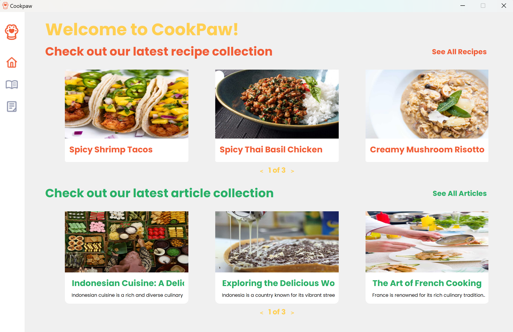
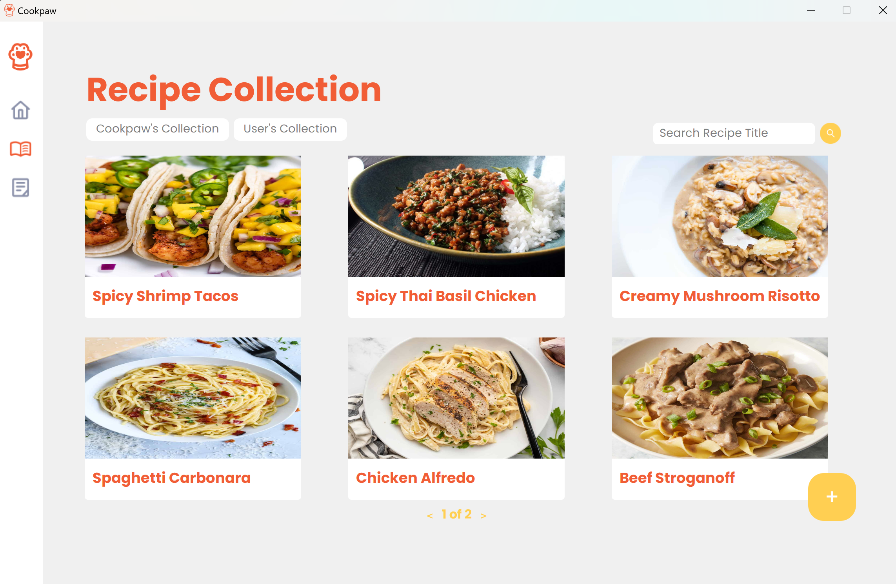
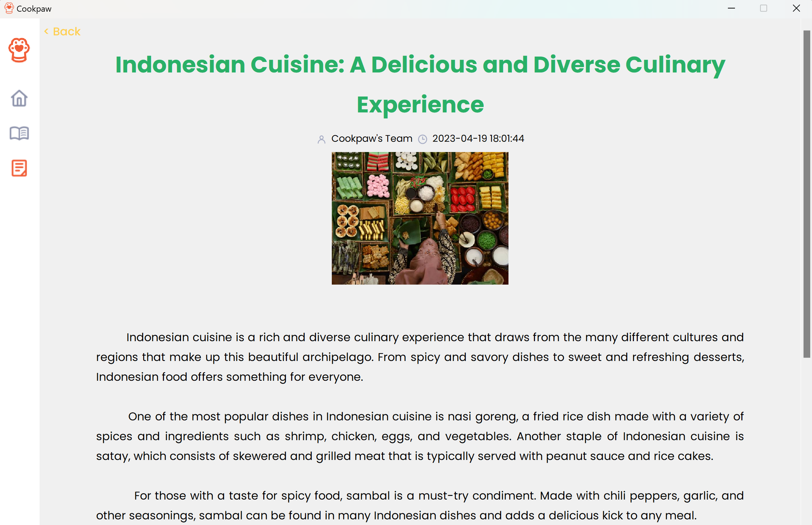
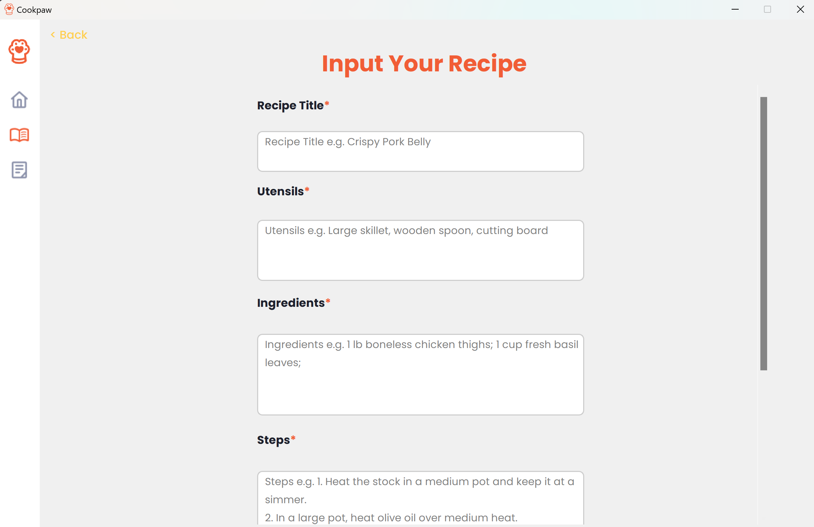
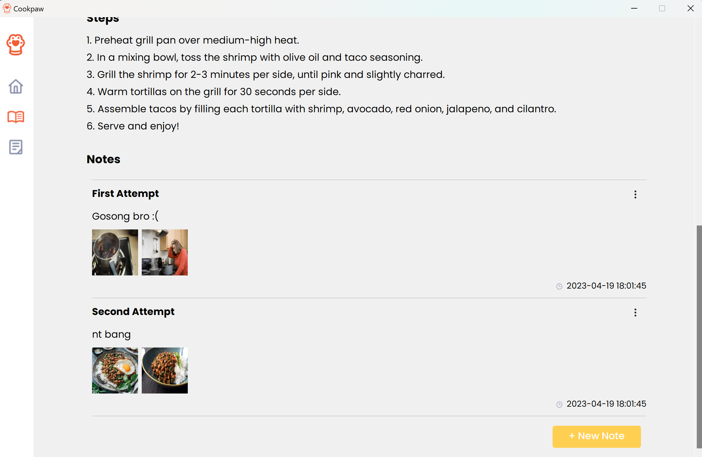
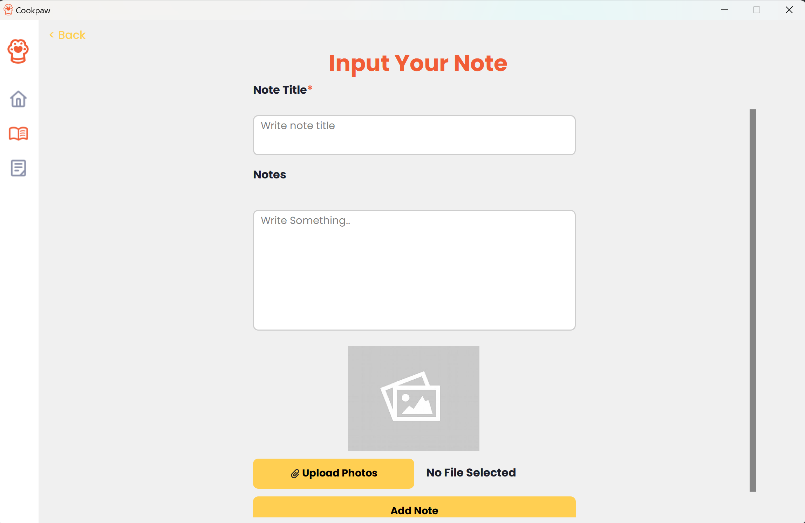

# CookPaw: Cooking Companion

## Overview


CookPaw is a desktop software application that can serve as a "cooking partner" for its users. CookPaw provides a collection of preloaded articles and recipes with detailed instructions, tools, and ingredients needed for cooking. Users of the application can also add, delete, or modify user-made recipes in the recipe list. Furthermore, users can add, delete, or modify notes of a recipe in the program.

Users who want to use the CookPaw application do not need to authenticate credentials and can use it directly. After logging into the application, users freely explore and use the application.

## Prerequisites

- `Python` 3.X installed
- `Pytest` installed for unit testing. To install, run the following command:

```bash
pip install pytest
```

- `PyQt5` installed. To install, run the following command:

```bash
pip install PyQt5
```

- `PIL` installed. To install, run the following command:

```bash
pip install pillow
```

- **Docker**, To install, head to https://www.docker.com/products/docker-desktop/.

- Cloned repository files. To clone, run one the following command:
```
git clone https://gitlab.informatika.org/rpl-g08/if2250-2023-k02-08-cookpaw.git
```
```
git clone git@gitlab.informatika.org:rpl-g08/if2250-2023-k02-08-cookpaw.git
```

## Setup
### Database
If the database `cookpaw.db` is not found in `/src/database/`, run the following command from the root of repository.

```bash
py src/database/db.py
```
### PyTest (Optional)

To test if the database is correctly initialized, run unit tests with following command from the root of repository.
```bash
pytest tests
```
It is recommended to have a newly initialized database for this test, as modifications might cause false negatives.

### Docker and CI/CD

This application development use CI/CD with `test` stage for testing the application using PyTest. The CI/CD runs on a docker runner implemented for this project. It is recommended to pull the docker image by following the instructions below.

#### For building new runner

- Build the docker

```bash
docker build -t gitlab-runner-rpl-k02-g08 .
```

- Set the tag of the runner and where to push

```bash
docker tag gitlab-runner-rpl-k02-g08:latest jeffreychow19/gitlab-runner-rpl-k02-g08:latest
```

- Login to docker hub if not yet logged in

```bash
docker login
```

- Push docker image to the docker hub

```bash
docker push jeffreychow19/gitlab-runner-rpl-k02-g08:latest
```

- Create container in docker

```bash
docker run -d --name gitlab-runner-rpl-k02-g08 -v /var/run/docker.sock:/var/run/docker.sock jeffreychow19/gitlab-runner-rpl-k02-g08:latest
```

#### For pulling docker

- Pull the image from docker

```bash
docker pull jeffreychow19/gitlab-runner-rpl-k02-g08:latest
```

- Create container in docker

```bash
docker run -d --name gitlab-runner-rpl-k02-g08 -v /var/run/docker.sock:/var/run/docker.sock jeffreychow19/gitlab-runner-rpl-k02-g08:latest
```

## How to Run the Application
### Starting the App
1. After setup, navigate to the root of this repository.
2. To start the application, run the following:

```bash
py src/main.py
```
### Navigation
On the left side of the screen is a sidebar which contains, from top to bottom, navigation buttons to homepage, recipe collection page, and article collection page. To navigate from the homepage, click on any sidebar buttons, or any cards and buttons on the carousel to navigate to any articles or recipes.

Below is the recipe collection page. The recipe collection page has a filter for preloaded recipes and user-made recipes, and a searchbar to search recipe titles.


Below is the article collection page. The article collection page has a search bar to search article titles.


Below is an example of an article detail page.


Below is an example of a recipe detail page.


Users can input keywords in the search bar to search for article or recipe titles.

### Create Recipes and Notes
To create a recipe, go to the recipe collection page and click the `(+)` icon. Next, fill recipe data, choose an image (optional), and click the button at the end of the page to save.


To create a note, visit a recipe and click `New Note`. Next, fill in the details, choose an image (optional), and click the button at the end of the page to save.



User can also edit or delete created recipes or note by clicking the dropdown menu on a created recipe or note.

## Modules
TBA
## Database Structure
TBA

## Authors & Contributions
### Authors
| NIM      | Name                  | GitHub                                            |
| -------- | --------------------- | ------------------------------------------------- |
| 13521044 | Rachel Gabriela Chen  | [chaerla](https://github.com/chaerla)             |
| 13521046 | Jeffrey Chow          | [JeffreyChow19](https://github.com/JeffreyChow19) |
| 13521074 | Eugene Yap Jin Quan   | [yuujin-Q](https://github.com/yuujin-Q)           |
| 13521094 | Angela Livia Arumsari | [liviaarumsari](https://github.com/liviaarumsari) |
| 13521100 | Alexander Jason       | [AJason36](https://github.com/AJason36)           |
### Contributions
| NIM      | Contributions |
| -------- | ------------- |
| 13521044 | Home page, database, controller, unittest      |
| 13521046 | Recipe list, article list, CI/CD               |
| 13521074 | Note editor (add/edit) page, testing           |
| 13521094 | Recipe detail page, article detail page        |
| 13521100 | Recipe editor (add/edit) page                  |
