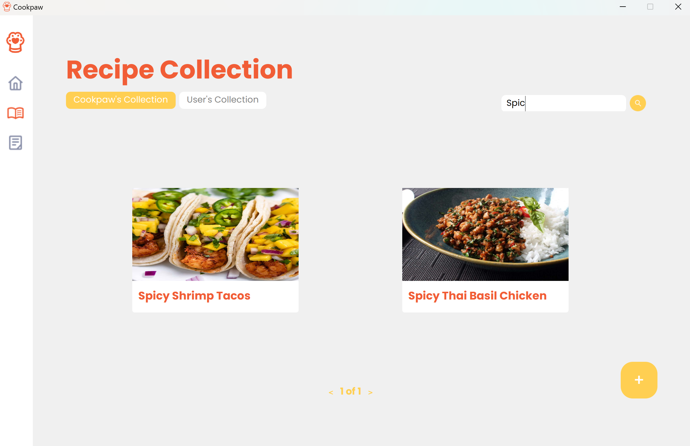
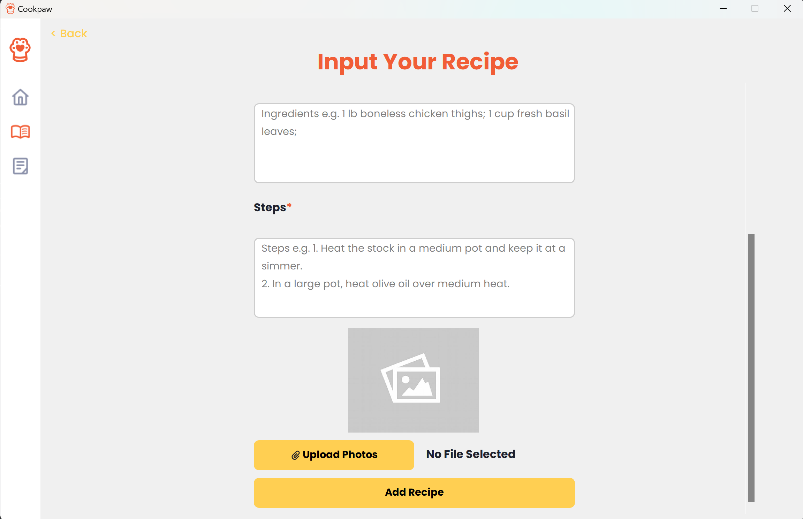
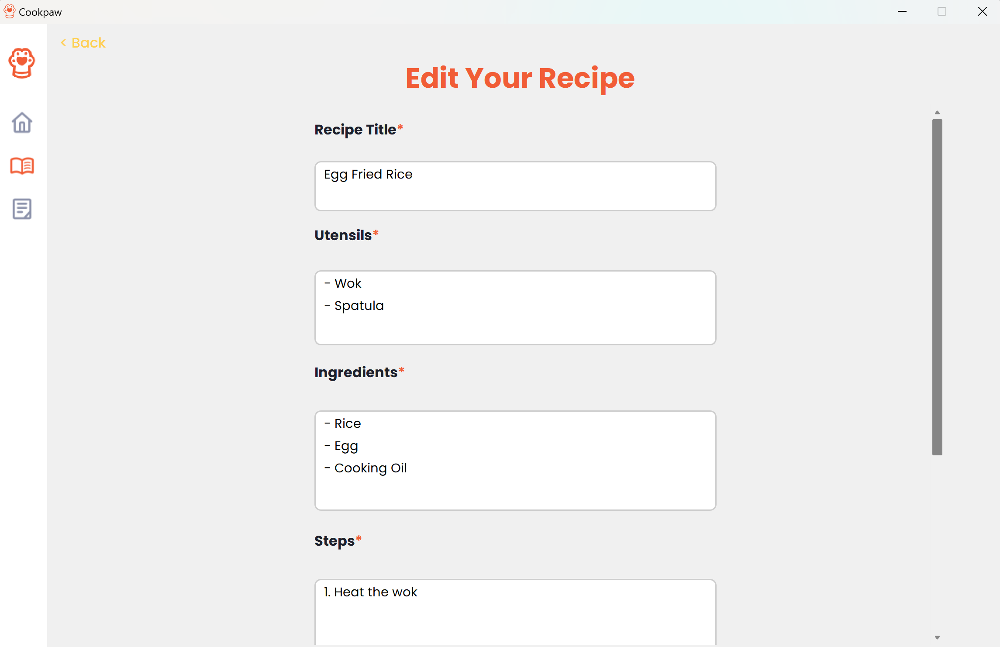
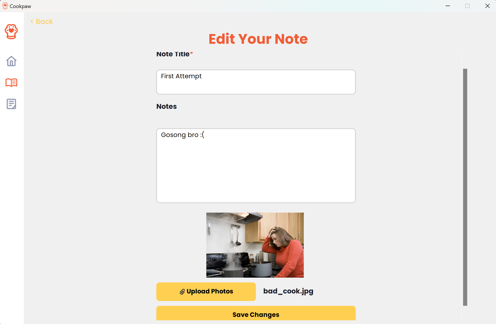

# UI Pages
Below are screenshots and person-in-charge of each UI page modules.

## Homepage
### Description
- PIC: Rachel Gabriela Chen
- Components: sidebar, cards carousel, card
### Screenshot

## Recipe Collection
### Description
- PIC: Jeffrey Chow
- Components: sidebar, cards carousel, card
### Screenshot

Filter and search bar are not in use

Search bar is in use

User filter is in use

## Article Collection
### Description
- PIC: Jeffrey Chow
- Components: sidebar, cards carousel, card
### Screenshot

## Recipe Detail
### Description
- PIC: Angela Livia Arumsari
- Components: dropdown, back button, message box, collection button
### Screenshot

## Article Detail
### Description
- PIC: Angela Livia Arumsari
- Components: back button
### Screenshot

## Recipe Editor
### Description
- PIC: Alexander Jason
- Components: message box, textbox, form question, form button, back button
### Screenshot

Create new Recipe

Edit existing Recipe

## Note Editor
### Description
- PIC: Eugene Yap Jin Quan
- Components: message box, textbox, form question, form button, back button
### Screenshot

Create new Note

Edit existing Note
